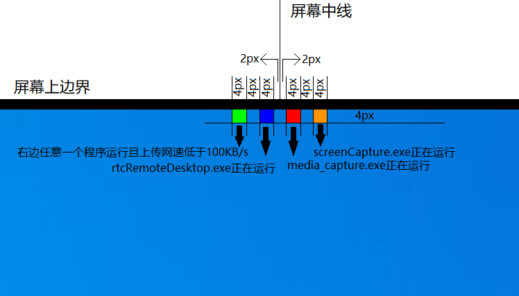

# Privacy

## 程序介绍

由于11月10日学校对所有Seewo设备进行了重置，并统一部署了“希沃管家”软件，学校利用该软件监视着学生与教师，还时常进行一些不必要的操作，严重干扰了教师的教学活动（例如，在授课过程中突然进行集中控制且无法退出；下课后准备课件时，因系统集控而无法操作一体机，导致不得不占用上课时间进行准备），因此，我们启动了这一项目，旨在改善这一现状。

该项目的主要功能是防范与预警。例如，当一天到晚不干正事到处转悠等着拿钱还时不时整花活三观不正的电教主任，或是教师试图远程查看设备摄像头、监听麦克风、查看屏幕、进行远程操作时，系统会立即发出提示。同时，系统还会在日常运行中显示一些关键的状态信息。然而，需要指出的是，本项目所具备的对抗功能相对有限，我们认为有更加有效激进的对抗策略。

## 通用的原理

## 软件功能

- [x] 监控状态提示（包括摄像头、远程桌面）
- [ ] 摄像头使用提示
- [ ] 麦克风使用提示 
- [ ] 指定软件网络请求提示
- [ ] 四指下滑（触控屏）或 Ctrl+Win+Alt+Shift+D 取消所有程序置顶并回到桌面
- [ ] 八指长按（触控屏）或 Ctrl+Alt+Win+T 置顶处于当前焦点的程序
- [ ] ~~独占摄像头~~（开发困难，暂不考虑）
- [ ] ~~独占麦克风~~（开发困难，暂不考虑）

## 使用说明

### Status_Prompter

该软件能够在监控活动发生时及时发出提示。

#### 逻辑机制

该程序主要监控以下三个进程：`media_capture.exe`、`screenCapture.exe`和`rtcRemoteDesktop.exe`，同时监测上行网络速度。以下图详细阐述了管理的四个状态区块的具体位置及其触发条件。

尤为值得一提的是，当检测到`media_capture.exe`正在运行且上行网络速度达到或超过100kb/s时，程序会进一步判断当前系统音量。若音量低于12%，程序将自动调高音量后播放预设声音，否则直接播放预设声音，若调整过音量，则会在播放结束后恢复原始音量。只要上述任一条件不再满足，程序将判断当前系统音量。若音量低于12%，程序将自动调高音量后播放另一个预设声音，否则直接播放预设声音，若调整过音量，则会在播放结束后恢复原始音量。

## 鸣谢

感谢以下仓库为本项目提供思路和部分代码

[DengHanxu/SeewoMonitorSystem](https://github.com/DengHanxu/SeewoMonitorSystem "DengHanxu/SeewoMonitorSystem")

###### 名人名言

> 公共场合你没有隐私
